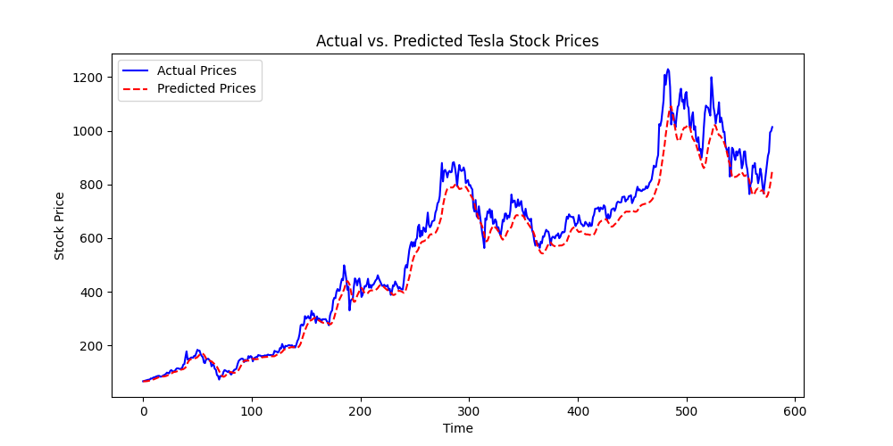

# Tesla Stock Price Prediction using LSTM

Live Demo

Check out the live demo of the Tesla Stock Price Prediction App:
🔗 Live Demo on Streamlit https://amazoncustomersentimentanalysis-tmuqmkhxqcbhn8fizsin9e.streamlit.app/
 

This project demonstrates how to use Long Short-Term Memory (LSTM) networks to predict Tesla stock prices based on historical stock data. LSTMs are powerful for time-series forecasting, making them highly effective for stock price prediction.

## Project Overview

Stock price prediction is a challenging task due to the volatile nature of financial markets. This project leverages deep learning techniques to predict Tesla’s stock closing prices using historical stock data.

✅ Why LSTM?

LSTM networks are designed to handle sequential data and remember long-term dependencies.

They can effectively capture trends and patterns in stock price movements.

More accurate than traditional regression models for time-series forecasting.


### Project Structure

📦 tesla-stock-lstm
├── 📁 data                  # Dataset & processed data
├── 📁 results               # Model & prediction results
├── 📁 notebooks             # Jupyter Notebooks for each stage
├── app.py                   # Streamlit App for predictions
├── requirements.txt         # Required dependencies
├── README.md                # Project Documentation


### Steps:
1. **Data Collection**: Using `yfinance` to collect Tesla stock price data.
2. **Data Preprocessing**: Normalizing the data and creating a look-back window to predict future stock prices.
3. **Model Building**: Using Keras to build a multi-layer LSTM model.
4. **Training and Evaluation**: Training the model and evaluating its performance using metrics such as MSE, RMSE, and MAE.
5. **Visualization**: Comparing the predicted stock prices with the actual stock prices to evaluate model performance.

## Dataset
The dataset was sourced from [Kaggle](https://www.kaggle.com/datasets/varpit94/tesla-stock-data-updated-till-28jun2021) and contains historical stock data for Tesla, including:
- **Date**: The specific trading day.
- **Open**: Stock opening price.
- **High**: Highest price during the trading day.
- **Low**: Lowest price during the trading day.
- **Close**: Stock closing price, used for predictions.
- **Volume**: Number of shares traded.

## Model Architecture

The model consists of:

Two LSTM layers with 50 units, followed by Dropout layers to prevent overfitting.

The final output layer is a dense layer that predicts the closing price.


## Results

   The model's performance was evaluated using the following metrics:
   ## Model Performance
   Mean Squared Error (MSE): 3753.8690004458163
	Root Mean Squared Error (RMSE): 61.26882568195523
	Mean Absolute Error (MAE): 44.11808127674939

### Example Plot: Actual vs Predicted Stock Prices




## Instructions to Run

To get this project running on your local machine, follow these steps:

### 1. Clone the Repository
   First, clone this repository to your local machine using Git:

   ```bash
   git clone https://github.com/himanshu-dandle/tesla-stock-lstm.git
   cd tesla-stock-lstm

### Set Up a Virtual Environment
   conda create --name lstm_env python=3.8
   conda activate lstm_env

### Install Dependencies
   pip install -r requirements.txt

###Run the Jupyter Notebook
   jupyter notebook
   
   Navigate to the notebooks/ directory in Jupyter and open the tesla_lstm.ipynb file. Run the notebook cells sequentially to preprocess data, train the model, and    visualize results.	
   
### Run the Streamlit App
	streamlit run app.py

   

##Viewing Results
   The Actual vs Predicted Stock Prices plot and Training/Validation Loss plot will be generated and saved in the results/ folder.
   The model’s performance metrics, such as Mean Squared Error (MSE) and Root Mean Squared Error (RMSE), will also be displayed in the notebook.

## Future Enhancements
1. **Hyperparameter Tuning**: Further optimize LSTM hyperparameters (e.g., layers, dropout, learning rate).
2. **Feature Engineering**: Add more technical indicators like moving averages or Bollinger Bands to improve model accuracy.
3. **External Factors**: Incorporate other data sources (e.g., news sentiment analysis or macroeconomic indicators).
4. **Deploying the Model**: Consider deploying the model as an API using Flask or FastAPI.
