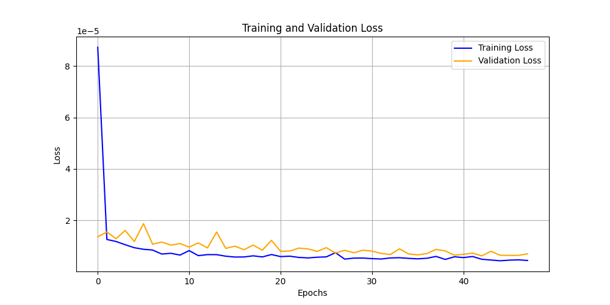

# Tesla Stock Price Prediction using LSTM

This project demonstrates how to use Long Short-Term Memory (LSTM) networks to predict Tesla stock prices based on historical stock data. LSTMs are powerful for time-series forecasting, making them highly effective for stock price prediction.

## Project Overview

This project focuses on predicting Tesla's stock prices using historical stock data and a Long Short-Term Memory (LSTM) neural network. LSTMs are highly effective for time-series forecasting tasks as they can capture temporal dependencies and patterns in sequential data, making them ideal for stock price prediction.

The main goal of this project is to predict Tesla’s stock closing prices based on past prices, allowing for better insight into future price movements. Accurate stock price prediction can be beneficial for making informed investment decisions, analyzing market trends, and managing risk.

We chose LSTM because it can retain information over long sequences, making it suitable for modeling stock market data, which is known for its volatility and time-dependent characteristics.

### Steps:
1. **Data Collection**: Using `yfinance` to collect Tesla stock price data.
2. **Data Preprocessing**: Normalizing the data and creating a look-back window to predict future stock prices.
3. **Model Building**: Using Keras to build a multi-layer LSTM model.
4. **Training and Evaluation**: Training the model and evaluating its performance using metrics such as MSE, RMSE, and MAE.
5. **Visualization**: Comparing the predicted stock prices with the actual stock prices to evaluate model performance.

## Dataset
The dataset was sourced from [Kaggle](https://www.kaggle.com/datasets/varpit94/tesla-stock-data-updated-till-28jun2021) and contains historical stock data for Tesla, including:
- **Date**: The specific trading day.
- **Open**: Stock opening price.
- **High**: Highest price during the trading day.
- **Low**: Lowest price during the trading day.
- **Close**: Stock closing price, used for predictions.
- **Volume**: Number of shares traded.

## Model Architecture

The model consists of:
- Two LSTM layers with 128 and 64 units, followed by Dropout layers to prevent overfitting.
- The final output layer is a dense layer that predicts the closing price.

## Results

   The model's performance was evaluated using the following metrics:
   ## Model Performance
   - **Mean Squared Error (MSE)**: 2210.75
   - **Root Mean Squared Error (RMSE)**: 47.02
   - **Mean Absolute Error (MAE)**: 33.17


### Example Plot: Actual vs Predicted Stock Prices




## Instructions to Run

To get this project running on your local machine, follow these steps:

### 1. Clone the Repository
   First, clone this repository to your local machine using Git:

   ```bash
   git clone https://github.com/himanshu-dandle/tesla-stock-lstm.git
   cd tesla-stock-lstm

### Set Up a Virtual Environment
   conda create --name lstm_env python=3.8
   conda activate lstm_env

### Install Dependencies
   pip install -r requirements.txt

###Run the Jupyter Notebook
   jupyter notebook

   Navigate to the notebooks/ directory in Jupyter and open the tesla_lstm.ipynb file. Run the notebook cells sequentially to preprocess data, train the model, and    visualize results.

##Viewing Results
   The Actual vs Predicted Stock Prices plot and Training/Validation Loss plot will be generated and saved in the results/ folder.
   The model’s performance metrics, such as Mean Squared Error (MSE) and Root Mean Squared Error (RMSE), will also be displayed in the notebook.

## Future Enhancements
1. **Hyperparameter Tuning**: Further optimize LSTM hyperparameters (e.g., layers, dropout, learning rate).
2. **Feature Engineering**: Add more technical indicators like moving averages or Bollinger Bands to improve model accuracy.
3. **External Factors**: Incorporate other data sources (e.g., news sentiment analysis or macroeconomic indicators).
4. **Deploying the Model**: Consider deploying the model as an API using Flask or FastAPI.
